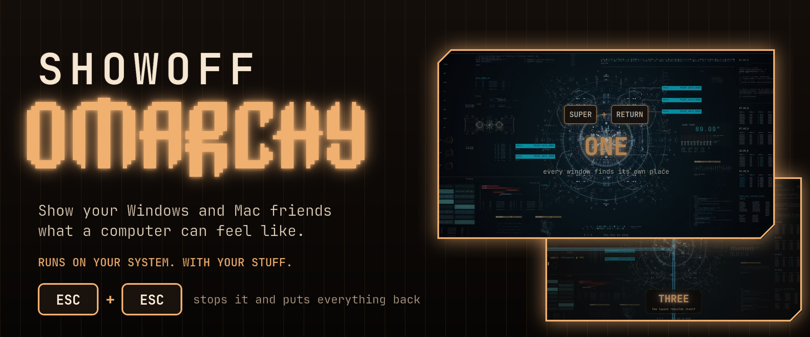

<p align="center">
  
</p>

# Showoff Omarchy

For every omarchy user with a friend on Windows or a Mac.

Showoff Omarchy takes over your screen and shows Omarchy off, on **your
system, with your stuff**: your apps, your themes, your wallpapers. Big glowing
captions float over the real desktop, every shortcut shows up as a keycap
before it happens, and partway through it hands your friend the keyboard.

Press **Esc twice** at any point and it stops, putting everything back exactly
as it was.

## Install

```bash
git clone https://github.com/nixfred/showoff.omarchy
cd showoff.omarchy && makepkg -si
```

pacman owns every file. It lands in your launcher as **Showoff Omarchy**.
Remove it with `sudo pacman -R showoff-omarchy`.

## Run it

```
showoff        the whole show, about 4 minutes
showoff x      an 80 second cut that screen records itself to ~/Videos, for posting
```

## What it shows

In order:

1. The OMARCHY wordmark, glowing in your theme's color.
2. [omarchy.org](https://omarchy.org) in a new browser window.
3. Terminals tiling themselves, one popped out to float and snapped back.
4. A fly through four workspaces.
5. **Your friend picks the theme** with the arrow keys, and every app recolors live.
6. Theme roulette, landing on their pick.
7. Wallpapers, video ones included, then **your friend picks one**.
8. `btop`, installed on screen in seconds if it isn't there yet.
9. cava, cmatrix and asciiquarium, all at once.
10. fastfetch, and YouTube running as its own app window.
11. The emoji picker and clipboard history.
12. A tour of the Omarchy menu.
13. Night light, gaps and fullscreen, each a single key.
14. **Your turn:** your friend launches an app from the Apps menu.
15. A local AI answer, if Ollama is running.
16. The screensaver.
17. Two QR codes to take home, and one question: keep the theme, or put it all back?

If nobody touches the keyboard, the pickers drive themselves after a few
seconds. The full detail is in [ACTS.md](ACTS.md).

## Runs on any Omarchy

- **Omarchy 4.0 or newer.** It runs on Quickshell, which every Omarchy 4
  desktop already has, and drives the stock `omarchy-*` commands.
- **Depends on no plugin** and runs as its **own process**, so it can't take
  your bar down with it.
- **Uses your real keybindings.** The keycaps are read live from Hyprland, so
  they show what *your* machine does.
- **Plays on a spare workspace.** Your open windows are never touched.
- **Skips what you don't have.** An act that needs a missing program (cava,
  ttfx, Ollama) is skipped with one line and the show carries on.
- **Puts everything back.** Theme, wallpaper and workspace are restored when it
  ends or when you press Esc twice, unless your friend chose to keep the theme.
  Every window it opened is closed.

## Repo map

- `bin/showoff`: the launcher. `app/`: the application (Quickshell).
  `app/acts.js`: the whole show as data, one row per act.
- [ACTS.md](ACTS.md): every act and the running order.
- [CLAUDE.md](CLAUDE.md): the project brief and the decisions made.
- [RESEARCH.md](RESEARCH.md): what Omarchy and Quickshell provide, with file anchors.
- `PKGBUILD`: the package.

MIT. Built by [nixfred](https://github.com/nixfred) and Larry.
